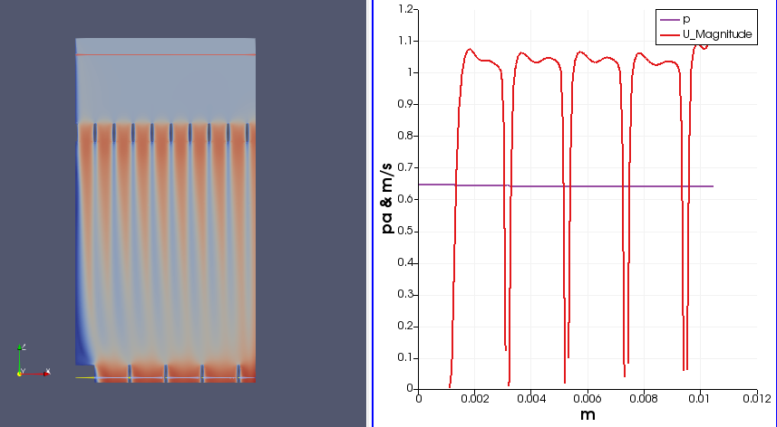
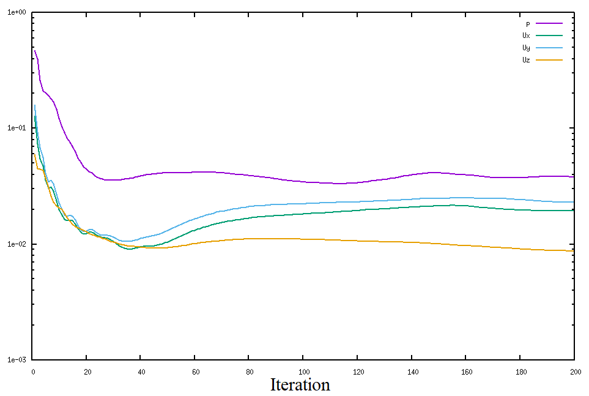
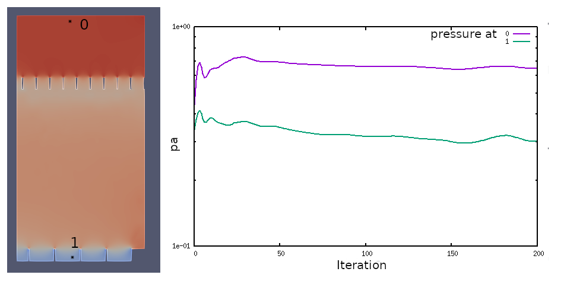
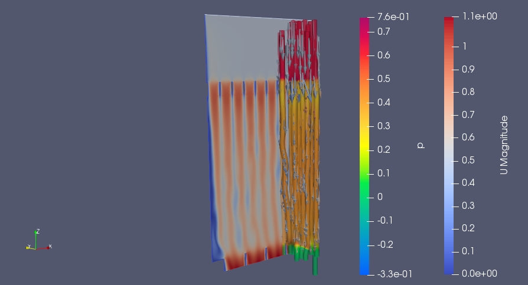
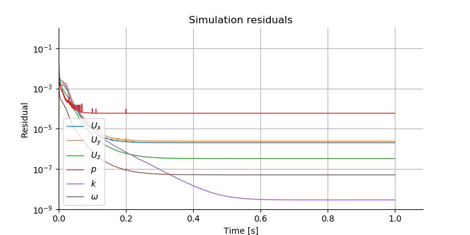
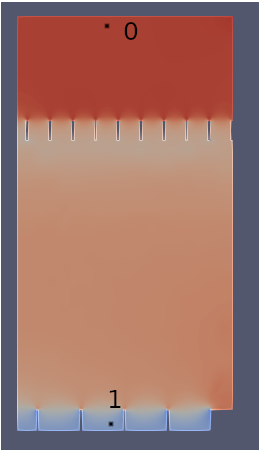

**CFD-Project**
************************************************  
|                   |                                  |
| ----------------- | -------------------------------- |
| **Project Title** | Flow analysis of the faucet aerator
| project start     | 01.11.2022
| project end       | 31.12.2022
| cfd engineer      | Shasi Adhikari
| design engineer   | Shasi Adhikari
| checked by        | Jan Lehmkuhl
   

<!-- example picture for quick project identification -->
 
Faucet Aerator

­

Management-Summary
===============================================================================

Background
---------------------------------------------------------------------

 
The faucet aerators control the flow rate to less than 10 l/m, allowing air entrainment and resulting in fine droplets. Furthermore, these faucets are not always used with constant flow rates. Compared to regular faucets, aerators compress the water flow into a higher-pressure discharge. They also add air bubbles to the water, which gives the impression that the flow of the water is greater. Mostly, the difference in the amount of water coming out of the faucet is unnoticeable. Additionally, it has been claimed by most aerator manufactures that their aerators can save up to 50% of water flow compared to the regular faucet. However, in this project, only the water flow from the geometry and only one flow rate will be considered. 
<!-- 
Contribution for the better enviroment by reducing the utilization of resourcess is eccential in this century. One of the natural resuorces that is ofened considered is the water. Water conservation have become necessity for the modern environment. By taking into these factors, technology has offered a water saving device for the householsds i.e. aerators. The aeration process used in kitchen and bathroom faucets regulates and reduces water consumption. This reduces water usage and results in non-splash flow, so these fittings in water taps act as water saving devices.
 

 
The faucet aerators control the flow rate to less than 10 l/m, allowing air entrainment and resulting in fine droplets. As a result, the amount of water used is reduced. Therefore, in the morden households all of the faucets are equiped with aerators. These aerators reduce the flow of water by mixing the water with the air. The main function of the faucet areator is to devide the main stream of water into multiple small streams and introduce the air into it. when the air enters in the flow, automatically the volume of water flow will be reduced.
 

 
 
Compared to regular faucets, aerators compress the water flow into a higher pressure discharge. They also add air bubbles to the water, which gives the impression that the flow of the water is grater. Mostly, the difference in the amount of the water comming out of the faucet are unnoticeable. Aditionally, it has been clamimed by the most of aerator manufactures that their aerators can save upto 50% of water flow compared to the regular faucet. 
 

 
 
 Furthermore, these faucets are not always used with constant flow rates. Figure below shows the three flow rate of a kitchen faucet. It is visivile in these picture there are some air-bubbles are present in the folw streem of the water. 

fig :- 1. water flow from kitchen faucet (laminar flow (left),higher flow (middle) and maximum flow (right))
-->

<!-- 
* which information is needed to understand the project goals
* this should be understand by every friend or manager
 -->

Goals
---------------------------------------------------------------------

 
<!--This study aims to analyse the working principle and effectiveness of the faucet aerators. The figure above makes it ckear that the areators in fact mixes the air in the flow streem of the water. Therefore, this research intends to explain the listed points about the faucet aerators. 
-->

This study aims to visualize the velocity profile of the flow and calculate pressure loss.
<!--
+ Understand the flow of the aerated water.
+ Visualize the mixing process of the water and air.
+ Measure the discharge of the faucet. 
-->
<!-- 
* which goal should be reached within this project
  * maximum 400 characters
  * bulletpoints with max 10 words
  * more explanations belong to the background
* more than one goal should be avoided
  * multiple goals are complex to reach 
* goals are about knowledge to achieve
  * e.g. optimize the flow in something, understand the physics from something
  * this is not about simulations
    * simulations are the howto-tools to reach your goals and 
    * simulations are explained later in the report
 -->

Major Work Packages
---------------------------------------------------------------------
<!-- 
* maximum 700 characters
    * detailed explanations later
* which simulations are/will be used to achieve your goals
* which special information should each study (group of similar simulations) deliver to reach the project goals
* which numbers are calculated in the postprocessing
 -->
<!--This project is conducted in the process of learning CFD simulation in openfoam. Due to the complexity of the project and the time limitation it has been divided into two steps. In the first step, only the flow of water will be simulated and studied. Afterward, with the knowledge and experience, both material flows will be simulated. 
-->

<!--
-->

### Simulation of steady-state with Laminar turbulence model
<!--####  Simplification of geometry. 
The flow on the aerator is via two screens on the pipe. Since only the water is considered as the flowing material, the air inlet can be ignored. Furthermore, the screens can be modeled with small diameter holes on the cross-section of the pipe. Additionally, the geometry has rotational symmetry from the central axis. Therefore, the geometry can be further simplified from the central axis.
#### Mesh creation 
The flow channel of the water from the screen is represented with the 1 and 2-mm diameter holes. therefore the mesh that will be created should be relatively small to have a decent mesh of the geometry. The cfMesh will be used to create the surface mesh.
#### simulation 
-->
The first simulation that will be conducted will be a steady-state simulation with the laminar turbulence model. It is expected that this simulation will provide a basic understanding of the flow of water through multiple screens. 

### Transient simulation with RANS(kOmmegaSST) turbulence model 
Since the steady state simulation showed the transient behaviour, it is necessary to do a transient simulation to have a better understanding of the flow. Therefore, a transient simulation with RANS(kOmmegaSST) turbulence model can be conducted. 

<!-- 
* where are not yet solved issues or problems which can threaten the project outcome
* e.g. numerics in study 1 are bad, you don't know yet to apply special model features, ...
 -->

Results
---------------------------------------------------------------------
### Simulation of steady-state with Laminar turbulence model  
+ Simulation ended with 0.01 residuals
+ Velocity streams show transient behavior.
+ Requires another approach of simulation.
### Transient simulation with RANS(kOmmegaSST) turbulence model  
+ The flow's pressure loss is 0.641 pa. 
+ The flow is comparable to pinching a garden hose with your finger to increase flow velocity.
   
<!-- 
The velocity streams and pressure of the flow at the inlet as well as the velocity profile at the outlet are shown in the figure below. 

fig :- Pressure at inlet and velocity at outlet.
<!-- 
* which goals or partial goals are reached at this moment
* can be devided in parts for every study
 -->

<!-- 
* next steps and timeframe
* whats your plan for the next week
 -->

Available Resources
===============================================================================

Timeframe and Human Resources
---------------------------------------------------------------------
This project is conducted as a fulfillment of the course 'Computational Fluid Dynamics'. Therefore, it is estimated to finish within 12.01.2023. Since, it is a semester project, 4 hours per week time is allocated for the project. 

<!-- 
* deadlines
* dependent projects
* necessary completed projects
 -->

<!-- 
* full time project? 
* estimated hours per week
 -->

Calculation Enviroment
---------------------------------------------------------------------
<!-- 
* Short description of the hard- and software used to create the analysis. 
* The objective of this section is: 
  * to ensure reproducible results for the case of later reruns 
  * to be aware of the possible simulations delivered in a specified time 
 -->

### Hardware

|          |                                                                                        |
| -------- | ------------------------------------------------------------------ |
| Machine  | 
| System   | Host: Linux  Kernel: 5.15.0-52-generic   Distro:  58~20.04.1-Ubuntu SMP  
| CPU      | Intel(R) Core(TM) i5-4300M  Cache: 3 MB   Max. clock speed: 2.60 GHz 
| Memory   | Manufacturer:   Type: 1600 MHz   Speed: 1600 MHz   Size: 12 GB 

 

### Software

| Task              | Programm                                          |
| ----------------- | ------------------------------------------------- |
| CAD               | FreeCAD 0.21 Revision
| stl               | FreeCAD 0.21 Revision
| background mesh   | OpenFoam 9
| mesh              | OpenFoam 9
| solver            | OpenFoam 9
| paraview          | paraview 5.6.0 

 

Simulation Study 1 : Steady-State simulation with laminar turbulance model
===============================================================================

Reality Description
---------------------------------------------------------------------

### Geometry
There are two types of faucet aerators available in the market. They are categorized by how they are fitted on the tip of the faucet. An aerator that comes with an external thread and is placed inside the end of the tap is called male and with the internal thread is called female. Both of them come in standard dimensions as shown in the figure.  

fig :- Faucet areator assembly
<!-- 
* description of the geometry features and their size
* use real world pictures not simplified CAD data
 -->

### Physics
The basic working principle of the faucet aerator is water flowing from two screens and mixing air in between while redirecting the flow of water by some obstacles. The flows of the fluids are shown below. 

fig :- Flow direction of water and air in the aerator
<!-- 
* which physical effects occur
* make sketches to describe special effects (you need less words)

| used materials    | used place    | density   | dyn. viscosity|
| ----------------- | ------------- | --------- | ------------- |
| material 1        |               | xx [kg/m³]| xx [kg/m/s]   |

| thermodynamic value   | occurring range   |
| --------------------- | ----------------- |
| pressure              | xxx [Pa] 
| velocities            | xxx [m/s]
| temperature           | xxx [C]

 -->

Model & Numerics
---------------------------------------------------------------------

### Geometry

The geometry has rotational symmetry from the central axis. Therefore, only a 60° span at the cross section from the central axis is taken into consideration for the simulation. The screens are modeled with small diameter holes on the cross-section of the pipe as shown in the figure below. Additionally, the flow governer and air inlet are ignored. Some of the basic dimensions are given below.

| Feature                     | Dimension                                   |
| --------------------------- | ------------------------------------------- |
| Pipe Diameter               | 21 mm
| Pipe height                 | 24 mm
| Small hole diameter         | 1 mm
| No. of small hole           | 45
| Large hole diameter         | 2 mm
| No. of large hole           | 10

fig :- Simplification of the geometry
<!-- 
* simplifications of the 3D model
* show pictures of the CAD model
 -->

### Mesh
The mesh is created with the 'cfmesh' with the base element of 0.1mm. the final mesh matrix obtained for the simulation is listed below. 

| Mesh                      | Value     |
| ---------------------     | --------- |
| number of hexahedra:      | 1155405 
| number of prisms:         | 3342
| number of tetrahedra:     | 5790
| number of pyramids:       | 9885
| max skewness              | 3.60146
<!--
| number of wedges:     | 0 
| number of tet wedges:     | 0 
| number of polyhedra:      | 0 
| min y+ (runXXX)           | XXX 
| max y+ (runXXX)           | XXX 
-->
 
<!-- not used mesh elements can be deleted -->

The mesh created was later visualized in the 'paraview'. The Mesh of the two screens is shown in the figures below.

fig :- Mesh on the screen (screen with smaller holes)

fig :- Mesh on the screen (screen with larger holes)
<!-- 
* show pictures of meshing from important geometry features
* is there a specific fokus (mesh refinements at place X)
* are special features applied (boundary layers, ...)
 -->

### Physical Modeling

| Domain    | Setting               | Value             | checked       |
| --------- | --------------------- | ----------------- | ------------- |
| Inlet1    | Volume Flow           | 28000 [mm^3/s]  |               |

### Numerics 

| setting               | occuring range    |
| --------------------- | ----------------- |
| reference pressure    | 0 [Pa]
| turbulence model      | Laminar
| residual target       | 10e-4

### Convergence
<!-- 
* show plots for all subtopics for at least the used runs in the postprocessing
 -->
The convergence is monitored with the Global residuals and the monitor point stability. The figure below shows the plots of those parameters.

fig :- Global Residuals.

fig: Pressure probe at given locations.

 

### Numerical Confidence
In the simulation after 200 steps of the iteration, the residuals are slightly less than 1e-1 and looking at the pressure probes, the values are in 1e-1. therefore, it can be said that the results are not good enough for numerical convergence. 
<!-- 
* how exact, do you think, are the calculation results
* how big are the changes in the result, when you change the setup
 -->

Flow Analysis 
---------------------------------------------------------------------

The figure below shows the velocity distribution and the streamlines of the flow. 

fig :- Velocity,streamlines and vector plot at streamlines

 The velocity streams are time-dependent, which is a sign of the transient behavior of the flow. Thus, it is required to have another simulation to confirm the convergence and transient behavior.        

<!-- 
* collection of simulations which share similar geometry and settings
* together these simulation study leads to specific conclusions
* e.g. test of geometry changes
* a second study might be a simulation to determine specific boundary conditions for a first study
* describe which conclusions will be desirable from each study
 -->

<!-- 
* show expected behaviour to increase the confidence in the simulation
* show special and interesting flow features to get more insights
* describe for every picture what you see and you want to be seen by the reader 
* what is your conclusion of the picture
* break the results down to single numbers, e.g.: 
    * (average) velocities (at specific points of interest)
    * pressure values
* this should be the biggest part in this report

 
 -->

Simulation Study 2 : Transient simulation with RANS turbulance model
===============================================================================
In this simulation, only the turbulence model is changed to the RANS-kOmegwSST model. All the other parameters are kept similar to the simulation study 1.

### Numerics 

| setting               | occuring range    |
| --------------------- | ----------------- |
| reference pressure    | 0 [Pa]
| turbulence model      | RANS(kOmegaSST)
| residual target       | 10e-4

### Convergence
<!-- 
* show plots for all subtopics for at least the used runs in the postprocessing
 -->
The convergence of the simulation is also monitored with the Global residuals and the monitor point stability and plots of those parameters are shown below.

fig : Global Residuals of transient simulation.

fig: Pressure probe at given locations.

### Numerical Confidence
The residuals of the transient simulation of the flow for 1s are below 10e-4. After 0.6 s all of the residuals are steady. Similarly, the pressure probes are also steady with 10e-6 precision after 0.2 seconds.  

<!-- 
* how exact, do you think, are the calculation results
* how big are the changes in the result, when you change the setup
 -->

Flow Analysis 
---------------------------------------------------------------------
The figure below shows the velocity distribution and the streamlines of the flow. It can be seen from the figure that the velocity is increased on the screens. Since the fluid is constrained to flow from those smaller channels, it was expected to have a higher velocity in those areas. Furthermore, streamlines also showcase the pressure distribution. Pressure is higher in the inlet and drops suddenly at the first screen and gradually increases and drops again at the second screen.   

fig :- Velocity,streamlines and vector plot at streamlines

The figures below show the velocity profile and pressure of the different regions. The velocity profile of these regions in the transient simulations at the middle section are not time-dependent.

fig :- Velocity and Pressure at inlet.

fig :- Velocity and Pressure at Screen 1.

fig :- Velocity and Pressure at middle.

fig :- Velocity and Pressure at Screen 2 (outlet).

The velocity profile of the inlet shows the friction on the wall. Therefore, it is close to zero at the wall. Similarly, the parabolic velocity profile at other locations is due to wall friction. Whereas, on screen 2, the profile is uneven. It is due to a combination of multiple velocity streams from screen 1. Moreover, with the given boundary conditions the pressure loss of the flow is about 0.641pa. 
<!-- 
* what have you learned so far in this study 
* the overall conclusions should be placed in "Results" in the Management Summary
 -->

Conclusion
===============================================================================

Only water will flow from the faucet if the aerator's air inlet is blocked while it is in use. The internal geometry of the aerator at the faucet's tip causes the water flow to differ from that of a regular faucet. The screens used in this study have tiny, circular holes spread across the flow cross-section. These screens restrict water flow and lessen the cross-sectional area of the flow. It is similar to pinching a garden hose with your finger to increase flow velocity and lower pressure. Similarly, it is evident from the simulation that the water velocity increases and the pressure decrease at the aerator's outlet.   
